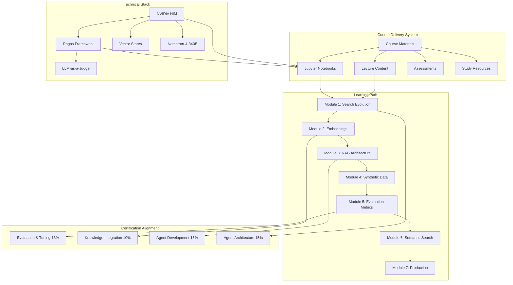
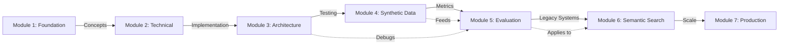
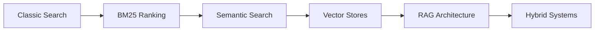
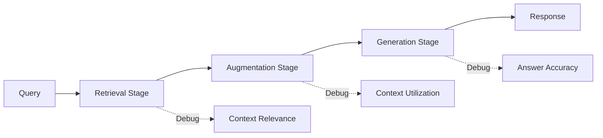
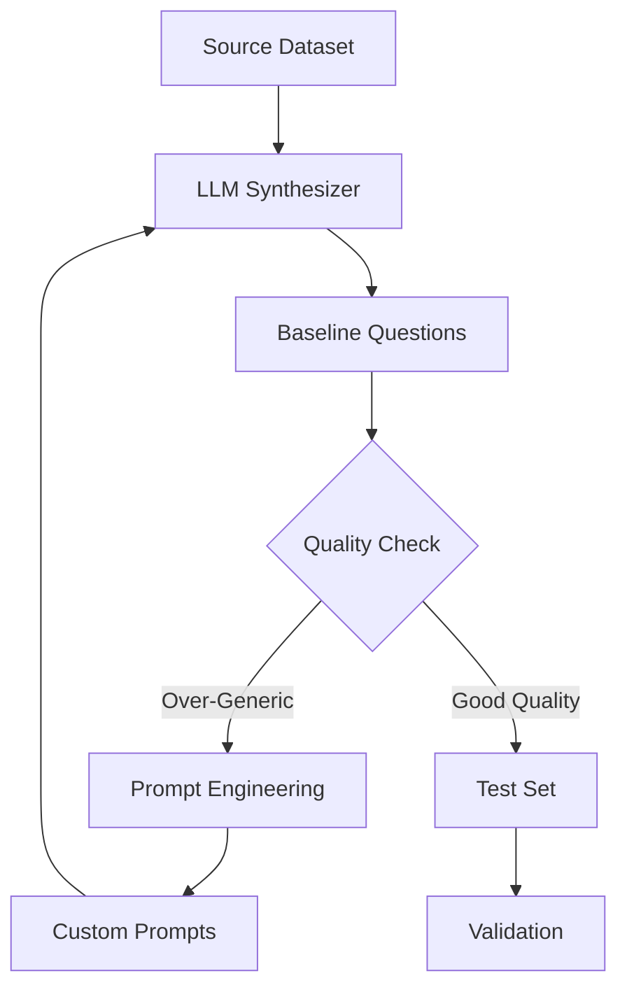
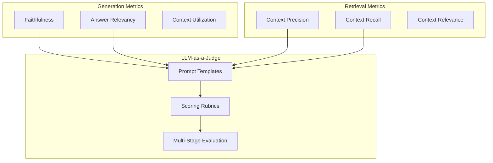
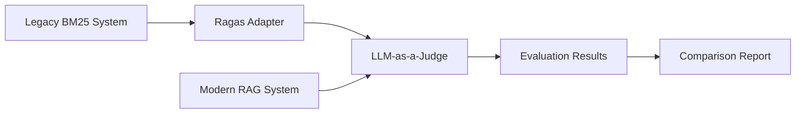
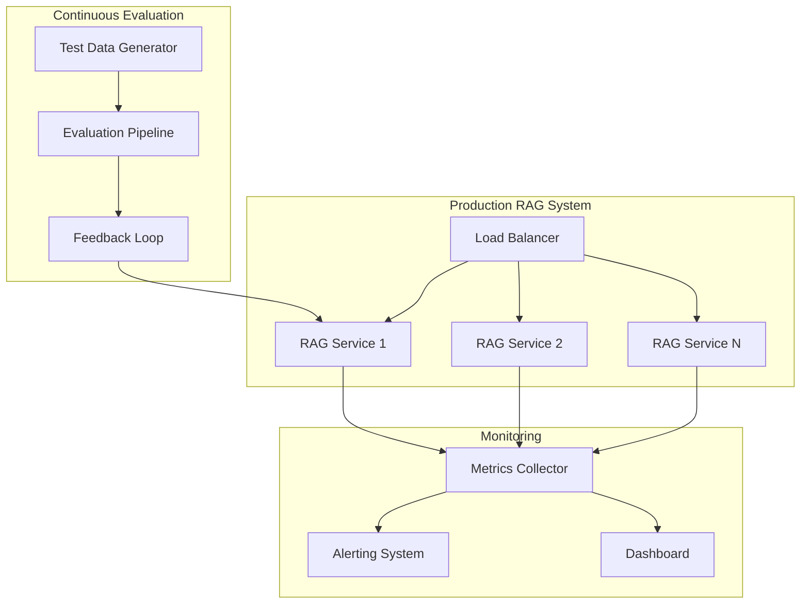
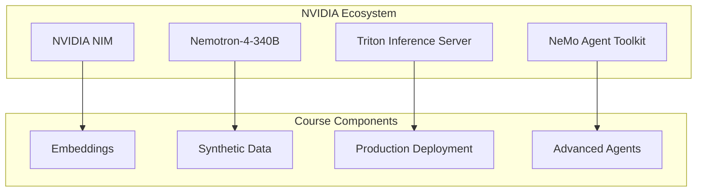

# Design Document: RAG Evaluation Course

## Overview

This design document specifies the architecture, components, and implementation approach for developing a production-ready course titled "Evaluating RAG and Semantic Search Systems." The course prepares candidates for the NVIDIA-Certified Professional: Agentic AI (NCP-AAI) certification exam, with primary focus on the Evaluation and Tuning domain (13% of exam weight).

The course follows a 7-module progressive learning path combining theoretical foundations with hands-on practice through Jupyter notebooks. Students will master RAG evaluation frameworks (Ragas), synthetic test data generation, LLM-as-a-Judge methodologies, and production deployment considerations. The design emphasizes practical skills over theoretical knowledge, with 50% of course time dedicated to hands-on exercises.

### Key Design Principles

1. **Certification-Driven**: Every module maps explicitly to NCP-AAI exam domains
2. **Hands-On First**: 50% hands-on practice, 40% lecture, 10% discussion
3. **Progressive Complexity**: Build from search fundamentals to production deployment
4. **Open-Ended Learning**: Exercises have multiple valid solutions to encourage experimentation
5. **NVIDIA Ecosystem Integration**: Leverage NIM, Nemotron, Triton, NeMo throughout
6. **Enterprise Reality**: Address legacy systems and hybrid approaches
7. **Test-Driven Development**: Emphasize evaluation as essential, not optional

## Architecture

### High-Level System Architecture



### Module Dependency Flow



## Components and Interfaces

### 1. Course Materials Component

**Purpose**: Deliver structured learning content through multiple formats

**Sub-Components**:

#### 1.1 Lecture Materials
- **Slide Decks**: Visual diagrams for architecture, data flow, metrics
- **Speaker Notes**: Instructor tips extracted from course transcripts
- **Case Studies**: Real-world examples from finance, healthcare, legal, e-commerce
- **Visual Aids**: Mermaid diagrams for system architecture and data flow

**Interface**:
```python
class LectureMaterial:
    module_number: int
    title: str
    slides: List[Slide]
    speaker_notes: Dict[int, str]  # slide_number -> notes
    diagrams: List[MermaidDiagram]
    case_studies: List[CaseStudy]
    
    def render_for_instructor() -> InstructorView
    def render_for_student() -> StudentView
    def export_to_pdf() -> bytes
```

#### 1.2 Jupyter Notebooks
- **Notebook 0**: Evolution from classic search to RAG
- **Notebook 1**: Baseline synthetic data generation
- **Notebook 2**: Customized synthetic data with prompt engineering
- **Notebook 3**: Ragas evaluation metrics implementation
- **Notebook 4**: Semantic search evaluation
- **Bonus Notebooks**: Advanced topics (production monitoring, A/B testing)

**Interface**:
```python
class JupyterNotebook:
    notebook_id: str
    module_number: int
    title: str
    learning_objectives: List[str]
    cells: List[NotebookCell]
    intentional_bugs: List[BugLocation]  # For debugging exercises
    datasets: List[DatasetReference]
    
    def validate_execution() -> ExecutionReport
    def extract_exercises() -> List[Exercise]
    def generate_solution_key() -> SolutionNotebook
```

#### 1.3 Assessment Component
- **Module Quizzes**: 5-10 questions per module
- **Hands-On Challenges**: Open-ended exercises with rubrics
- **Debugging Exercises**: Intentionally broken RAG pipelines
- **Design Challenges**: Architecture tasks for specific requirements
- **Capstone Project**: Complete RAG system for custom domain
- **Mock Certification Exam**: 60-70 questions, 120-minute simulation

**Interface**:
```python
class Assessment:
    assessment_type: AssessmentType  # QUIZ, HANDS_ON, DEBUG, DESIGN, CAPSTONE, MOCK_EXAM
    module_number: Optional[int]
    questions: List[Question]
    rubric: EvaluationRubric
    time_limit_minutes: Optional[int]
    
    def evaluate_submission(submission: StudentSubmission) -> Score
    def generate_feedback(submission: StudentSubmission) -> Feedback
```

### 2. Module Content Components

#### Module 1: Evolution of Search to RAG Systems

**Learning Flow**:


**Components**:
- **Search Paradigm Comparator**: Tool to run identical queries across different systems
- **BM25 Explainer**: Interactive visualization of keyword ranking
- **Embedding Visualizer**: Multi-dimensional similarity demonstration
- **Hybrid System Designer**: Framework for combining BM25 + Vector + Re-ranking

**Interface**:
```python
class SearchParadigmComparator:
    query: str
    systems: List[SearchSystem]  # BM25, Vector, Hybrid
    
    def run_comparison() -> ComparisonResults
    def visualize_results() -> Visualization
    def explain_differences() -> Explanation
```

#### Module 2: Embeddings and Vector Stores

**Components**:
- **Embedding Model Selector**: Decision matrix for domain-specific models
- **Vector Store Configurator**: Optimization strategies for different use cases
- **Chunking Strategy Tester**: Experimentation framework for chunk sizes
- **Tabular Data Transformer**: Methods for converting tables to embeddings

**Interface**:
```python
class EmbeddingPipeline:
    model: EmbeddingModel  # NVIDIA NIM, domain-specific
    vector_store: VectorStore  # Milvus, Pinecone, Chroma
    chunking_strategy: ChunkingStrategy
    
    def embed_documents(documents: List[Document]) -> List[Embedding]
    def configure_vector_store(config: VectorStoreConfig) -> None
    def optimize_retrieval(metrics: RetrievalMetrics) -> OptimizationReport
```

#### Module 3: RAG Architecture and Component Analysis

**Three-Stage Pipeline**:


**Components**:
- **RAG Pipeline Builder**: End-to-end system construction
- **Component Debugger**: Independent evaluation of retrieval vs. generation
- **Context Analyzer**: Relevance assessment tools
- **Failure Diagnostic Tool**: Pinpoint failure stages

**Interface**:
```python
class RAGPipeline:
    retriever: Retriever
    augmenter: Augmenter
    generator: Generator
    
    def process_query(query: str) -> Response
    def debug_retrieval(query: str) -> RetrievalDebugReport
    def debug_generation(query: str, context: str) -> GenerationDebugReport
    def evaluate_end_to_end(test_set: TestSet) -> EvaluationReport
```

#### Module 4: Synthetic Test Data Generation

**Data Generation Flow**:


**Components**:
- **Synthetic Data Generator**: LLM-based question generation using Nemotron-4-340B
- **Prompt Engineer**: Customization interface for steering data generation
- **Quality Validator**: Filtering and validation strategies
- **Synthesizer Mixer**: Combine multiple synthesizers (50-50 mix)

**Interface**:
```python
class SyntheticDataGenerator:
    base_model: LLM  # Nemotron-4-340B
    synthesizer_type: SynthesizerType  # SPECIFIC_QUERY, ABSTRACT, REASONING
    custom_prompt: Optional[str]
    examples: List[Example]  # 3-5 optimal
    
    def generate_questions(dataset: Dataset, num_samples: int) -> List[Question]
    def customize_prompt(instructions: str, examples: List[Example]) -> None
    def validate_quality(questions: List[Question]) -> QualityReport
    def mix_synthesizers(synthesizers: List[Synthesizer], ratios: List[float]) -> MixedSynthesizer
```

**Prompt Engineering Best Practices**:
1. **Extreme Specificity**: Write as if explaining to a child
2. **3-5 Examples**: Optimal number for steering without overfitting
3. **Explicit Negatives**: State what NOT to generate
4. **User Personas**: Define realistic scenarios
5. **Iterative Validation**: Test prompts multiple times

#### Module 5: RAG Evaluation Metrics and Frameworks

**Metric Architecture**:


**Components**:
- **Ragas Framework Integration**: Primary evaluation framework
- **Metric Customizer**: Modify existing metrics with custom prompts
- **Custom Metric Builder**: Create new metrics from scratch
- **LLM-as-a-Judge Engine**: Scalable evaluation using LLMs
- **Results Analyzer**: Interpretation and actionable insights

**Interface**:
```python
class EvaluationFramework:
    framework: str = "ragas"  # Primary framework
    llm_endpoint: str  # NVIDIA NIM endpoint
    metrics: List[Metric]
    
    def evaluate_rag(test_set: TestSet, rag_pipeline: RAGPipeline) -> EvaluationResults
    def customize_metric(metric_name: str, custom_prompt: str) -> CustomMetric
    def create_custom_metric(definition: MetricDefinition) -> CustomMetric
    def analyze_results(results: EvaluationResults) -> AnalysisReport
```

**Metric Definitions**:

1. **Faithfulness**: Are claims in response supported by context?
   - Multi-stage: Extract claims → Verify against context → Normalize score
   - Formula: `faithfulness = (verified_claims / total_claims)`

2. **Answer Relevancy**: Is response relevant to question?
   - Uses cosine similarity between question and response embeddings
   - Formula: `relevancy = cosine_similarity(embed(question), embed(response))`

3. **Context Precision**: Ranking quality of retrieved contexts
   - Measures if relevant contexts appear higher in ranking
   - Formula: `precision@k = (relevant_in_top_k / k)`

4. **Context Recall**: Coverage of ground truth in retrieved contexts
   - Measures if all necessary information was retrieved
   - Formula: `recall = (ground_truth_covered / total_ground_truth)`

5. **Context Relevance**: Is retrieved context relevant to question?
   - Binary classification for each retrieved chunk
   - Formula: `relevance = (relevant_chunks / total_chunks)`

#### Module 6: Semantic Search System Evaluation

**Legacy System Integration**:


**Components**:
- **Legacy System Adapter**: Apply Ragas to non-RAG search systems
- **BM25 Evaluator**: Keyword search evaluation with modern techniques
- **Hybrid Evaluator**: Combined RAG + Semantic Search assessment
- **Ranking Analyzer**: Algorithm assessment and optimization

**Interface**:
```python
class SemanticSearchEvaluator:
    search_system: SearchSystem  # BM25, Vector, Hybrid
    evaluation_framework: EvaluationFramework
    
    def adapt_for_legacy(system: LegacySearchSystem) -> AdaptedSystem
    def evaluate_search(queries: List[str]) -> SearchEvaluationResults
    def compare_with_rag(rag_system: RAGPipeline) -> ComparisonReport
    def optimize_ranking(current_results: SearchResults) -> OptimizationSuggestions
```

#### Module 7: Production Deployment and Advanced Topics

**Production Architecture**:


**Components**:
- **Production Monitor**: Continuous evaluation and observability
- **A/B Testing Framework**: Compare RAG system variants
- **Temporal Data Handler**: Time-weighted retrieval strategies
- **Compliance Checker**: GDPR, HIPAA validation
- **Performance Profiler**: Cost-efficiency vs. accuracy trade-offs

**Interface**:
```python
class ProductionRAGSystem:
    rag_pipeline: RAGPipeline
    monitoring: MonitoringSystem
    evaluation_pipeline: ContinuousEvaluation
    compliance_checker: ComplianceChecker
    
    def deploy(config: DeploymentConfig) -> DeploymentStatus
    def monitor_performance() -> PerformanceMetrics
    def run_ab_test(variant_a: RAGPipeline, variant_b: RAGPipeline) -> ABTestResults
    def check_compliance(regulations: List[Regulation]) -> ComplianceReport
    def optimize_costs(constraints: CostConstraints) -> OptimizationPlan
```

### 3. Dataset Management Component

**Datasets**:

1. **USC Course Catalog** (Primary)
   - **Format**: Tabular data (CSV)
   - **Size**: ~1000 courses
   - **Use Cases**: Chunking practice, domain-specific queries, tabular data handling
   - **Challenges**: Structured data in embeddings, column selection, label addition

2. **Amnesty Q&A** (Secondary)
   - **Format**: Pre-formatted for Ragas (JSON)
   - **Fields**: user_input, retrieved_context, response, ground_truth
   - **Use Cases**: Metric computation, faithfulness evaluation
   - **Advantages**: No preprocessing required

**Interface**:
```python
class DatasetManager:
    datasets: Dict[str, Dataset]
    
    def load_dataset(name: str) -> Dataset
    def preprocess_tabular(df: DataFrame, config: PreprocessConfig) -> ProcessedDataset
    def format_for_ragas(dataset: Dataset) -> RagasDataset
    def validate_format(dataset: Dataset) -> ValidationReport
```

### 4. Technical Stack Integration Component

**NVIDIA Platform Integration**:



**Components**:
- **NVIDIA NIM Integration**: Embedding models and LLM inference
- **Nemotron Integration**: Synthetic data generation models
- **Triton Integration**: Production deployment examples
- **NeMo Integration**: Advanced agent development references

**Interface**:
```python
class NVIDIAPlatformIntegration:
    nim_endpoint: str
    api_key: str
    
    def get_embedding_model(model_name: str) -> EmbeddingModel
    def get_llm_endpoint(model_name: str) -> LLMEndpoint
    def get_nemotron_synthesizer() -> SyntheticDataModel
    def configure_triton_deployment(config: TritonConfig) -> DeploymentPlan
```

### 5. Assessment and Certification Component

**Assessment Types**:

1. **Module Quizzes**: Knowledge validation after each module
2. **Hands-On Challenges**: Practical skill demonstration
3. **Debugging Exercises**: Problem-solving with broken systems
4. **Design Challenges**: Architecture and system design
5. **Capstone Project**: End-to-end RAG system implementation
6. **Mock Certification Exam**: Full exam simulation

**Interface**:
```python
class CertificationPreparation:
    exam_blueprint: ExamBlueprint
    practice_questions: List[Question]
    mock_exams: List[MockExam]
    
    def generate_practice_questions(topic: str, count: int) -> List[Question]
    def create_mock_exam() -> MockExam
    def evaluate_readiness(student_performance: PerformanceHistory) -> ReadinessReport
    def map_to_exam_domains(module: Module) -> List[ExamDomain]
```

## Data Models

### Core Data Structures

```python
from dataclasses import dataclass
from typing import List, Dict, Optional
from enum import Enum

@dataclass
class Module:
    module_number: int
    title: str
    duration_minutes: int
    learning_objectives: List[str]
    lecture_materials: LectureMaterial
    notebooks: List[JupyterNotebook]
    assessments: List[Assessment]
    exam_domain_mapping: Dict[str, float]  # domain -> weight

@dataclass
class ExamDomain:
    name: str
    weight_percentage: float
    topics_covered: List[str]
    coverage_level: CoverageLevel  # PRIMARY, CORE, SUPPORTING, CONTEXTUAL

class CoverageLevel(Enum):
    PRIMARY = "⭐⭐⭐"
    CORE = "⭐⭐⭐"
    SUPPORTING = "⭐⭐"
    CONTEXTUAL = "⭐"

@dataclass
class Question:
    question_text: str
    question_type: QuestionType  # MULTIPLE_CHOICE, SCENARIO, OPEN_ENDED
    options: Optional[List[str]]
    correct_answer: Optional[str]
    explanation: str
    exam_domain: str
    difficulty: Difficulty  # BEGINNER, INTERMEDIATE, ADVANCED

@dataclass
class TestSet:
    questions: List[str]
    contexts: List[str]
    responses: List[str]
    ground_truths: List[str]
    metadata: Dict[str, any]

@dataclass
class EvaluationResults:
    metrics: Dict[str, float]  # metric_name -> score
    detailed_results: List[DetailedResult]
    summary: str
    recommendations: List[str]

@dataclass
class RAGComponent:
    component_type: ComponentType  # RETRIEVAL, AUGMENTATION, GENERATION
    implementation: any
    configuration: Dict[str, any]
    
class ComponentType(Enum):
    RETRIEVAL = "retrieval"
    AUGMENTATION = "augmentation"
    GENERATION = "generation"
```

### Tabular Data Transformation

**USC Course Catalog Transformation**:
```python
@dataclass
class CourseRecord:
    course_name: str
    units: int
    catalog_description: str
    schedule_time: str
    instructor: str
    prerequisites: List[str]
    
    def to_embedding_string(self, include_labels: bool = True) -> str:
        """
        Transform tabular row to self-descriptive string for embedding.
        
        Example output:
        "Class name: CSCI 567. The course will cover the following topics: 
        Machine Learning fundamentals. Units: 4. Schedule: MW 2:00-3:20 PM."
        """
        if include_labels:
            return f"Class name: {self.course_name}. The course will cover the following topics: {self.catalog_description}. Units: {self.units}. Schedule: {self.schedule_time}."
        else:
            return f"{self.course_name} {self.catalog_description} {self.units} {self.schedule_time}"
```

**Design Rationale**:
- **Row-based approach**: Each row becomes a single concatenated string
- **Column filtering**: Only include relevant columns (name, units, catalog, time)
- **Label addition**: Add descriptive labels ("Class name:", "Units:") for context
- **Self-descriptive**: String is understandable without table structure
- **Alternative approaches**: Could use column-based, LLM summarization, or selective data

## Correctness Properties

*A property is a characteristic or behavior that should hold true across all valid executions of a system—essentially, a formal statement about what the system should do. Properties serve as the bridge between human-readable specifications and machine-verifiable correctness guarantees.*

### Property Development Process

Before defining correctness properties, we perform acceptance criteria testing prework to analyze each requirement for testability. This analysis determines whether criteria can be tested as properties (universal rules), examples (specific cases), edge cases, or are not testable.


### Property Reflection

After analyzing all acceptance criteria, I've identified the following patterns:

**Redundancy Analysis**:

1. **Content Completeness Properties**: Many criteria (3.1-3.5, 4.1-4.6, 5.1-5.6, etc.) test that specific content exists in modules. These are all examples of the same pattern: "Module X contains content Y". Rather than creating separate properties for each, we can consolidate into a single comprehensive property about content completeness.

2. **Deliverable Existence Properties**: Multiple criteria test that specific deliverables exist (notebooks, datasets, guides). These can be consolidated into properties about deliverable completeness.

3. **Time Allocation Property**: Criterion 1.3 is unique and tests a universal rule about time allocation across all modules.

4. **Metadata Completeness Properties**: Criteria 2.1, 2.5, 17.2, 17.3 all test that metadata/annotations are complete. These can be consolidated.

5. **Conditional Content Properties**: Criteria 1.5, 10.2, 11.4, 18.4, 20.1, 20.4, 20.7 test rules that apply conditionally (WHEN/WHERE clauses). These are true properties that should hold universally when conditions are met.

**Properties to Keep**:
- Time allocation across modules (1.3) - unique property
- Technical modules have notebooks (1.5) - conditional property
- Module exam domain mapping (2.1) - metadata completeness
- Content exam domain references (2.5) - metadata completeness
- Notebooks contain intentional bugs (10.2) - conditional property
- Student datasets supported (11.3) - capability property
- Datasets have preprocessing utilities (11.4) - conditional property
- NVIDIA toolkit references throughout (12.6) - universal property
- Module quizzes have 5-10 questions (13.1) - range property
- Module concept summaries (17.2) - deliverable property
- Practice questions have explanations (17.3) - quality property
- Architecture explanations use diagrams (18.4) - conditional property
- Concept modules have definitions and diagrams (20.1) - conditional property
- Implementation modules have code walkthroughs (20.4) - conditional property
- Application modules have multi-industry use cases (20.7) - conditional property

**Properties to Consolidate**:
- All specific content completeness criteria (3.1-3.5, 4.1-4.6, etc.) → Examples, not properties
- All specific deliverable existence criteria → Examples, not properties
- Learning outcome criteria (19.1-19.8) → Not testable (pedagogical outcomes)

### Correctness Properties

Based on the prework analysis and reflection, here are the correctness properties for the RAG Evaluation Course system:

#### Property 1: Time Allocation Consistency

*For any* module in the course system, the time allocation should be approximately 40% lecture/demo, 50% hands-on practice, and 10% discussion/Q&A (within ±5% tolerance).

**Validates: Requirements 1.3**

**Rationale**: This ensures consistent pedagogical approach across all modules, maintaining the hands-on focus that is critical for practical skill development.

#### Property 2: Technical Modules Have Notebooks

*For any* module that introduces technical concepts (marked as technical=true), the course system should include at least one corresponding hands-on Jupyter notebook.

**Validates: Requirements 1.5**

**Rationale**: Technical concepts require hands-on practice. This property ensures students can immediately apply what they learn.

#### Property 3: Exam Domain Mapping Completeness

*For any* module in the course system, the module should have explicit mappings to NCP-AAI exam domains with weight percentages that sum to at least one exam domain.

**Validates: Requirements 2.1**

**Rationale**: Every module must contribute to certification preparation by mapping to specific exam domains.

#### Property 4: Exam Topic References

*For any* content item that addresses NCP-AAI exam topics, the content should explicitly reference the corresponding exam domain name and weight percentage.

**Validates: Requirements 2.5**

**Rationale**: Students need clear visibility into how content maps to certification requirements.

#### Property 5: Intentional Bugs in Notebooks

*For any* Jupyter notebook in the course system, the notebook should contain at least one intentional bug marked for student debugging practice.

**Validates: Requirements 10.2**

**Rationale**: Debugging is a critical skill. Intentional bugs provide safe practice opportunities.

#### Property 6: Student Dataset Support

*For any* student-provided domain-specific dataset that conforms to the expected format, the course system should be able to process it using the same pipelines as the provided datasets.

**Validates: Requirements 11.3**

**Rationale**: Students should be able to apply course techniques to their own domains, not just provided examples.

#### Property 7: Dataset Preprocessing Utilities

*For any* dataset provided by the course system, the system should include corresponding preprocessing scripts and data loading utilities.

**Validates: Requirements 11.4**

**Rationale**: Students shouldn't waste time on data loading boilerplate. Utilities ensure focus on learning objectives.

#### Property 8: NVIDIA Toolkit References

*For any* module in the course system, the module materials should include at least one reference to NVIDIA Agent Intelligence Toolkit or related NVIDIA platforms (NIM, Nemotron, Triton, NeMo).

**Validates: Requirements 12.6**

**Rationale**: NVIDIA platform proficiency is required for NCP-AAI certification. Consistent exposure throughout the course builds familiarity.

#### Property 9: Module Quiz Question Count

*For any* module in the course system, the module-end quiz should contain between 5 and 10 questions (inclusive) that mix conceptual and applied question types.

**Validates: Requirements 13.1**

**Rationale**: Consistent assessment depth across modules. Range allows flexibility while ensuring adequate coverage.

#### Property 10: Module Concept Summaries

*For any* module in the course system, the study guide should include a one-page key concepts summary for that module.

**Validates: Requirements 17.2**

**Rationale**: Concise summaries support review and retention. One-page constraint ensures focus on essential concepts.

#### Property 11: Practice Question Explanations

*For any* practice question in the course system, the question should include a detailed explanation of the correct answer and why other options are incorrect (for multiple choice).

**Validates: Requirements 17.3**

**Rationale**: Explanations transform practice questions into learning opportunities, not just assessment tools.

#### Property 12: Architecture Diagram Requirement

*For any* content that explains system architecture, the content should include at least one Mermaid diagram or equivalent visualization showing component relationships and data flow.

**Validates: Requirements 18.4**

**Rationale**: Visual representations are essential for understanding complex architectures. Mermaid ensures consistency and maintainability.

#### Property 13: Concept Module Foundations

*For any* module that presents new concepts (marked as concept_module=true), the module should include clear definitions and visual diagrams for each major concept introduced.

**Validates: Requirements 20.1**

**Rationale**: Conceptual foundations require both precise definitions and visual aids for different learning styles.

#### Property 14: Implementation Module Walkthroughs

*For any* module that presents implementations (marked as implementation_module=true), the module should include step-by-step code walkthroughs with explanatory comments.

**Validates: Requirements 20.4**

**Rationale**: Implementation skills require guided practice. Walkthroughs provide scaffolding for learning.

#### Property 15: Application Module Industry Coverage

*For any* module that presents applications (marked as application_module=true), the module should include real-world use cases from at least three different industries.

**Validates: Requirements 20.7**

**Rationale**: Multi-industry examples demonstrate broad applicability and help students transfer knowledge to their specific domains.

## Error Handling

### Error Categories and Handling Strategies

#### 1. Content Delivery Errors

**Scenario**: Jupyter notebook fails to execute due to missing dependencies or API issues

**Handling Strategy**:
- Pre-flight checks before course delivery to validate all dependencies
- Fallback to pre-computed outputs if live execution fails
- Clear error messages with troubleshooting steps
- TA support for technical issues during live delivery

**Implementation**:
```python
class NotebookExecutor:
    def execute_with_fallback(self, notebook: JupyterNotebook) -> ExecutionResult:
        try:
            result = self.execute_live(notebook)
            return result
        except DependencyError as e:
            logger.warning(f"Dependency error: {e}. Using pre-computed outputs.")
            return self.load_precomputed_outputs(notebook)
        except APIError as e:
            logger.error(f"API error: {e}. Check API key and endpoint.")
            return ExecutionResult(status="failed", error=str(e), 
                                 troubleshooting_steps=self.get_api_troubleshooting())
```

#### 2. Assessment Errors

**Scenario**: Student submission cannot be evaluated due to format issues

**Handling Strategy**:
- Validate submission format before evaluation
- Provide clear format requirements upfront
- Graceful degradation: partial credit for partially correct submissions
- Manual review option for edge cases

**Implementation**:
```python
class AssessmentEvaluator:
    def evaluate_with_validation(self, submission: StudentSubmission) -> EvaluationResult:
        validation = self.validate_format(submission)
        if not validation.is_valid:
            return EvaluationResult(
                status="format_error",
                message=f"Submission format invalid: {validation.errors}",
                required_format=self.get_format_requirements()
            )
        
        try:
            score = self.evaluate(submission)
            return EvaluationResult(status="success", score=score)
        except PartialEvaluationError as e:
            return EvaluationResult(
                status="partial",
                score=e.partial_score,
                message="Partial evaluation completed. Manual review recommended."
            )
```

#### 3. Dataset Errors

**Scenario**: Student-provided dataset doesn't conform to expected format

**Handling Strategy**:
- Validate dataset schema before processing
- Provide clear schema documentation and examples
- Suggest corrections for common format issues
- Support multiple common formats (CSV, JSON, Parquet)

**Implementation**:
```python
class DatasetValidator:
    def validate_and_suggest(self, dataset: Dataset) -> ValidationResult:
        schema_validation = self.validate_schema(dataset)
        if not schema_validation.is_valid:
            suggestions = self.generate_fix_suggestions(schema_validation.errors)
            return ValidationResult(
                is_valid=False,
                errors=schema_validation.errors,
                suggestions=suggestions,
                example_format=self.get_example_format()
            )
        return ValidationResult(is_valid=True)
```

#### 4. NVIDIA Platform Errors

**Scenario**: NVIDIA NIM API rate limits or service unavailability

**Handling Strategy**:
- Implement exponential backoff for rate limits
- Cache responses where appropriate
- Provide alternative endpoints or models
- Clear communication about service status

**Implementation**:
```python
class NVIDIAAPIClient:
    def call_with_retry(self, endpoint: str, payload: dict, max_retries: int = 3) -> Response:
        for attempt in range(max_retries):
            try:
                response = self.call_api(endpoint, payload)
                return response
            except RateLimitError as e:
                if attempt < max_retries - 1:
                    wait_time = 2 ** attempt  # Exponential backoff
                    logger.warning(f"Rate limit hit. Waiting {wait_time}s before retry.")
                    time.sleep(wait_time)
                else:
                    raise APIError("Max retries exceeded. Try alternative endpoint.") from e
            except ServiceUnavailableError as e:
                logger.error(f"Service unavailable: {e}")
                return self.use_fallback_endpoint(endpoint, payload)
```

#### 5. Evaluation Framework Errors

**Scenario**: Ragas evaluation fails due to malformed test data or LLM errors

**Handling Strategy**:
- Validate test data format before evaluation
- Implement graceful degradation: skip problematic samples
- Log detailed error information for debugging
- Provide partial results when possible

**Implementation**:
```python
class RagasEvaluator:
    def evaluate_with_error_handling(self, test_set: TestSet) -> EvaluationResults:
        validated_samples = []
        skipped_samples = []
        
        for sample in test_set.samples:
            if self.validate_sample(sample):
                validated_samples.append(sample)
            else:
                skipped_samples.append(sample)
                logger.warning(f"Skipping invalid sample: {sample.id}")
        
        try:
            results = self.evaluate(validated_samples)
            if skipped_samples:
                results.add_warning(f"Skipped {len(skipped_samples)} invalid samples")
            return results
        except LLMError as e:
            logger.error(f"LLM evaluation error: {e}")
            return self.fallback_to_traditional_metrics(validated_samples)
```

### Error Recovery Strategies

1. **Pre-flight Validation**: Validate all resources before course delivery
2. **Graceful Degradation**: Provide partial functionality when full functionality fails
3. **Clear Error Messages**: User-friendly messages with actionable troubleshooting steps
4. **Fallback Options**: Alternative approaches when primary method fails
5. **Comprehensive Logging**: Detailed logs for debugging and improvement
6. **Manual Override**: TA/instructor intervention for edge cases

## Testing Strategy

### Dual Testing Approach

The course system requires both **unit testing** and **property-based testing** to ensure comprehensive correctness validation. These approaches are complementary:

- **Unit Tests**: Verify specific examples, edge cases, and error conditions
- **Property Tests**: Verify universal properties across all inputs

Together, they provide comprehensive coverage: unit tests catch concrete bugs, while property tests verify general correctness.

### Unit Testing Strategy

**Focus Areas**:
1. **Specific Examples**: Demonstrate correct behavior for known inputs
2. **Edge Cases**: Boundary conditions, empty inputs, maximum sizes
3. **Error Conditions**: Invalid inputs, missing data, API failures
4. **Integration Points**: Component interactions, data flow between modules

**Example Unit Tests**:

```python
# Test specific module structure
def test_module_1_has_required_components():
    module = load_module(1)
    assert module.title == "Evolution of Search to RAG Systems"
    assert len(module.notebooks) >= 1
    assert module.notebooks[0].id == "notebook_0"

# Test edge case: empty dataset
def test_dataset_validator_handles_empty_dataset():
    validator = DatasetValidator()
    result = validator.validate(Dataset(samples=[]))
    assert not result.is_valid
    assert "empty dataset" in result.errors[0].lower()

# Test error condition: invalid API key
def test_nvidia_api_client_handles_invalid_key():
    client = NVIDIAAPIClient(api_key="invalid")
    with pytest.raises(AuthenticationError):
        client.call_api("embeddings", {"text": "test"})

# Test integration: notebook execution pipeline
def test_notebook_execution_pipeline():
    notebook = load_notebook("notebook_1")
    executor = NotebookExecutor()
    result = executor.execute(notebook)
    assert result.status == "success"
    assert len(result.outputs) == len(notebook.cells)
```

### Property-Based Testing Strategy

**Framework**: Use Hypothesis (Python) for property-based testing

**Configuration**: Minimum 100 iterations per property test (due to randomization)

**Property Test Tagging**: Each test must reference its design document property
- Tag format: `# Feature: rag-evaluation-course, Property {number}: {property_text}`

**Focus Areas**:
1. **Universal Rules**: Properties that hold for all valid inputs
2. **Invariants**: Conditions that remain true across transformations
3. **Consistency**: Relationships between components that must hold
4. **Comprehensive Input Coverage**: Test across wide range of generated inputs

**Property Test Examples**:

```python
from hypothesis import given, strategies as st
import pytest

# Feature: rag-evaluation-course, Property 1: Time Allocation Consistency
@given(st.builds(Module, 
                 lecture_minutes=st.integers(min_value=10, max_value=300),
                 hands_on_minutes=st.integers(min_value=10, max_value=300),
                 discussion_minutes=st.integers(min_value=10, max_value=300)))
def test_property_time_allocation_consistency(module: Module):
    """
    For any module, time allocation should be approximately 40% lecture,
    50% hands-on, 10% discussion (within ±5% tolerance).
    """
    total_time = module.total_duration_minutes()
    lecture_pct = (module.lecture_minutes / total_time) * 100
    hands_on_pct = (module.hands_on_minutes / total_time) * 100
    discussion_pct = (module.discussion_minutes / total_time) * 100
    
    assert 35 <= lecture_pct <= 45, f"Lecture {lecture_pct}% outside 40±5% range"
    assert 45 <= hands_on_pct <= 55, f"Hands-on {hands_on_pct}% outside 50±5% range"
    assert 5 <= discussion_pct <= 15, f"Discussion {discussion_pct}% outside 10±5% range"

# Feature: rag-evaluation-course, Property 2: Technical Modules Have Notebooks
@given(st.builds(Module, 
                 is_technical=st.booleans(),
                 notebooks=st.lists(st.builds(JupyterNotebook), min_size=0, max_size=5)))
def test_property_technical_modules_have_notebooks(module: Module):
    """
    For any module marked as technical, it should have at least one notebook.
    """
    if module.is_technical:
        assert len(module.notebooks) >= 1, \
            f"Technical module {module.title} has no notebooks"

# Feature: rag-evaluation-course, Property 9: Module Quiz Question Count
@given(st.builds(Quiz,
                 questions=st.lists(st.builds(Question), min_size=0, max_size=20)))
def test_property_module_quiz_question_count(quiz: Quiz):
    """
    For any module quiz, it should contain between 5 and 10 questions.
    """
    question_count = len(quiz.questions)
    assert 5 <= question_count <= 10, \
        f"Quiz has {question_count} questions, expected 5-10"

# Feature: rag-evaluation-course, Property 11: Practice Question Explanations
@given(st.builds(PracticeQuestion,
                 question_text=st.text(min_size=10),
                 correct_answer=st.text(min_size=1),
                 explanation=st.text(min_size=0)))
def test_property_practice_question_explanations(question: PracticeQuestion):
    """
    For any practice question, it should include a detailed explanation.
    """
    assert question.explanation is not None, "Question missing explanation"
    assert len(question.explanation) >= 50, \
        f"Explanation too short ({len(question.explanation)} chars), expected detailed explanation"

# Feature: rag-evaluation-course, Property 6: Student Dataset Support
@given(st.builds(Dataset,
                 format=st.sampled_from(["csv", "json", "parquet"]),
                 schema=st.builds(DatasetSchema)))
def test_property_student_dataset_support(dataset: Dataset):
    """
    For any student-provided dataset in supported format, the system should
    be able to process it using standard pipelines.
    """
    validator = DatasetValidator()
    validation_result = validator.validate(dataset)
    
    if validation_result.is_valid:
        processor = DatasetProcessor()
        result = processor.process(dataset)
        assert result.status == "success", \
            f"Failed to process valid dataset: {result.error}"

# Feature: rag-evaluation-course, Property 12: Architecture Diagram Requirement
@given(st.builds(ContentItem,
                 content_type=st.sampled_from(["architecture", "concept", "implementation"]),
                 diagrams=st.lists(st.builds(Diagram), min_size=0, max_size=5)))
def test_property_architecture_diagram_requirement(content: ContentItem):
    """
    For any content explaining architecture, it should include at least one diagram.
    """
    if content.content_type == "architecture":
        assert len(content.diagrams) >= 1, \
            "Architecture content missing required diagram"
        assert any(d.type == "mermaid" for d in content.diagrams), \
            "Architecture content should include Mermaid diagram"
```

### Test Data Generators

**Custom Hypothesis Strategies**:

```python
from hypothesis import strategies as st

# Generate realistic module configurations
@st.composite
def module_strategy(draw):
    module_number = draw(st.integers(min_value=1, max_value=7))
    is_technical = draw(st.booleans())
    
    # Technical modules should have more hands-on time
    if is_technical:
        hands_on_minutes = draw(st.integers(min_value=60, max_value=180))
        lecture_minutes = draw(st.integers(min_value=40, max_value=120))
    else:
        hands_on_minutes = draw(st.integers(min_value=30, max_value=90))
        lecture_minutes = draw(st.integers(min_value=60, max_value=150))
    
    discussion_minutes = draw(st.integers(min_value=10, max_value=30))
    
    return Module(
        module_number=module_number,
        is_technical=is_technical,
        lecture_minutes=lecture_minutes,
        hands_on_minutes=hands_on_minutes,
        discussion_minutes=discussion_minutes
    )

# Generate realistic datasets
@st.composite
def dataset_strategy(draw):
    format = draw(st.sampled_from(["csv", "json", "parquet"]))
    num_samples = draw(st.integers(min_value=10, max_value=1000))
    
    samples = []
    for _ in range(num_samples):
        sample = {
            "user_input": draw(st.text(min_size=10, max_size=200)),
            "retrieved_context": draw(st.text(min_size=50, max_size=500)),
            "response": draw(st.text(min_size=20, max_size=300)),
            "ground_truth": draw(st.text(min_size=20, max_size=300))
        }
        samples.append(sample)
    
    return Dataset(format=format, samples=samples)
```

### Testing Best Practices

1. **Balance Unit and Property Tests**: Don't over-test with unit tests when properties can cover many cases
2. **Focus Unit Tests on Examples**: Use unit tests for specific scenarios that demonstrate correct behavior
3. **Use Properties for Rules**: Universal rules should be property tests, not collections of unit tests
4. **Test Integration Points**: Unit tests should verify component interactions
5. **Generate Realistic Data**: Property test generators should create realistic, domain-appropriate data
6. **Fail Fast**: Tests should fail quickly with clear error messages
7. **Independent Tests**: Each test should be independent and not rely on others
8. **Comprehensive Coverage**: Combine unit and property tests for full coverage

### Continuous Testing

**Pre-Delivery Validation**:
- Run full test suite before each course delivery
- Validate all notebooks execute successfully
- Verify all datasets load correctly
- Check all API endpoints are accessible

**Post-Delivery Monitoring**:
- Collect student feedback on technical issues
- Track assessment completion rates
- Monitor notebook execution success rates
- Identify common error patterns for improvement

## Implementation Notes

### Technology Stack

**Implementation Language**: Python 3.10+ (all code examples and implementations use real Python code, not pseudocode)

**Core Technologies**:
- **Python 3.10+**: Primary language for notebooks and course infrastructure
- **JupyterLab**: Interactive notebook environment
- **NVIDIA NIM**: Embedding models and LLM inference
- **Ragas 0.1.x**: Evaluation framework
- **Hypothesis**: Property-based testing framework
- **pytest**: Unit testing framework

**Supporting Libraries**:
- **pandas**: Data manipulation for datasets
- **numpy**: Numerical computations
- **matplotlib/seaborn**: Visualization
- **mermaid-py**: Diagram generation
- **pydantic**: Data validation and settings management

### Development Workflow

1. **Content Development**: Create lecture materials and notebooks
2. **Validation**: Run property tests to verify correctness properties
3. **Integration**: Combine modules into cohesive course
4. **Testing**: Execute full test suite (unit + property tests)
5. **Review**: Instructor review and feedback incorporation
6. **Deployment**: Package for delivery platform
7. **Monitoring**: Track student progress and technical issues
8. **Iteration**: Incorporate feedback for continuous improvement

### Deployment Considerations

**Environment Setup**:
- Pre-configured JupyterLab with all dependencies
- NVIDIA API keys provisioned for course duration
- Datasets pre-loaded and validated
- Fallback mechanisms for API failures

**Scalability**:
- Support 20-50 concurrent students per session
- Load balancing for API calls
- Caching for frequently accessed resources
- Efficient resource cleanup after sessions

**Accessibility**:
- Screen reader compatible materials
- Alternative text for all diagrams
- Keyboard navigation support
- Adjustable font sizes and contrast

### Maintenance and Updates

**Regular Updates**:
- Quarterly review of NVIDIA platform changes
- Annual refresh of research paper references
- Continuous monitoring of Ragas framework updates
- Exam blueprint alignment verification

**Version Control**:
- Git repository for all course materials
- Semantic versioning for major updates
- Change logs for each version
- Backward compatibility considerations

---

**Design Document Version**: 1.0  
**Last Updated**: January 2026  
**Next Review**: April 2026
